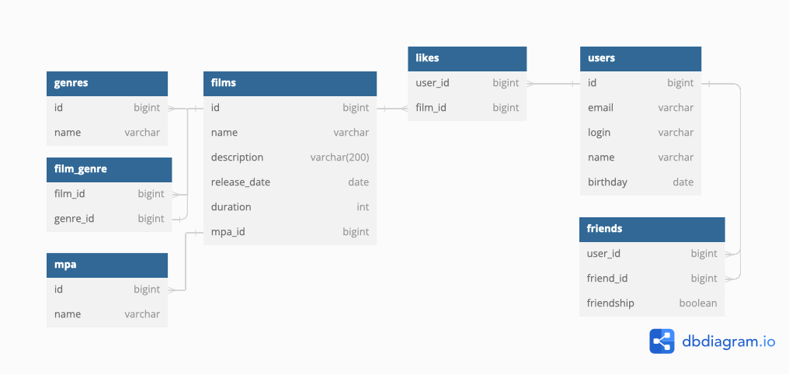

# java-filmorate

Filmorate — это приложение, которое поможет выбирать фильмы для просмотра, основываясь на оценках пользователей и рекомендациях. 

## Схема базы данных



### Таблицы и их назначения

- **films**: Хранит информацию о фильмах, включая название, описание, дату выхода и продолжительность.
- **users**: Хранит данные о пользователях, такие как электронная почта, логин, имя и дата рождения.
- **likes**: Служит для хранения информации о том, какие пользователи поставили лайк каким фильмам.
- **friends**: Хранит информацию о дружеских связях между пользователями.
- **film_genre**: Связывает фильмы с жанрами через идентификаторы.
- **genres**: Определяет жанры фильмов с уникальными идентификаторами и названиями.
- **mpa**: Содержит информацию о рейтингах MPA, включая их идентификатор (id) и название (name).


### Принципы проектирования

- Каждый столбец содержит только одно значение. Массивы или вложенные записи не используются, что соответствует правилу первой нормальной формы (1NF).
- Каждая таблица имеет первичный ключ (например, id в таблицах films, users, и film_genre), и все неключевые атрибуты (например, name, email, description) однозначно определяются этим ключом. Это соответствует правилу второй нормальной формы (2NF).
- Неключевые атрибуты в каждой таблице зависят только от первичного ключа и не зависят от других неключевых атрибутов. Например, в таблице users столбцы email, login, name и birthday зависят только от id, а не друг от друга. Это соответствует правилу третьей нормальной формы (3NF).

### Основные операции и примеры запросов

#### Получение всех фильмов

```sql
SELECT f.*, m.name AS mpa_name 
FROM films f 
JOIN mpa m ON f.mpa_id = m.id;
```

#### Получение всех пользователей

```sql
SELECT * FROM users;
```

#### Получение топ-N наиболее популярных фильмов

```sql
SELECT f.*, COUNT(l.user_id) AS count
FROM films f
LEFT JOIN likes l ON f.id = l.film_id
GROUP BY f.id
ORDER BY count DESC
LIMIT :count;
```

#### Получение списка общих друзей с другим пользователем

```sql
SELECT u2.id, u2.name
FROM friends f1
JOIN friends f2 ON f1.friend_id = f2.friend_id
JOIN users u2 ON f2.friend_id = u2.id
WHERE f1.user_id = :userId1 AND f2.user_id = :userId2;
```

#### Добавление лайка фильму

```sql
INSERT INTO likes (film_id, user_id) VALUES (:filmId, :userId);
```
##  Структура проекта

### Модели данных

В проекте используются следующие модели данных:

- Film

- Film Genre

- Genres

- Likes

- Mpa

- User

### Хранение данных

На текущем этапе данные хранятся в памяти приложения. 

### Валидация

Для обеспечения корректности данных используется валидация. 

### Логирование

Логирование добавлено для операций изменения сущностей и для причин ошибок валидации.

### Тестирование

Добавлены unit-тесты для валидации моделей и тестирование API с помощью Postman.


